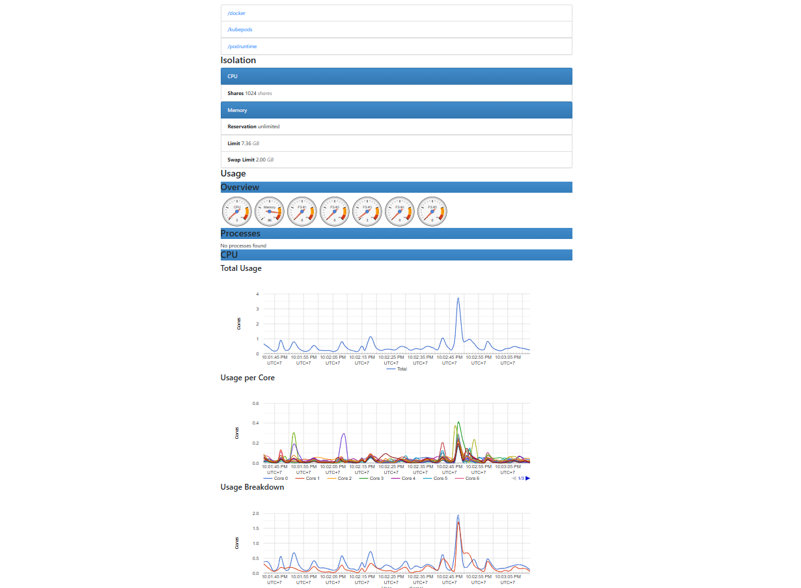
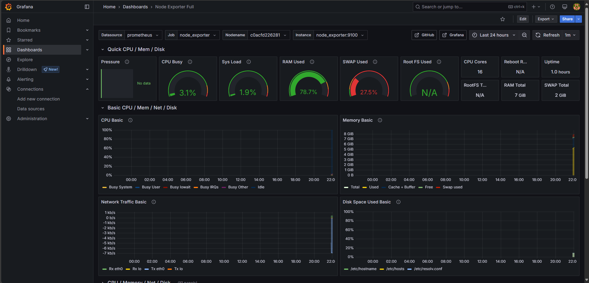
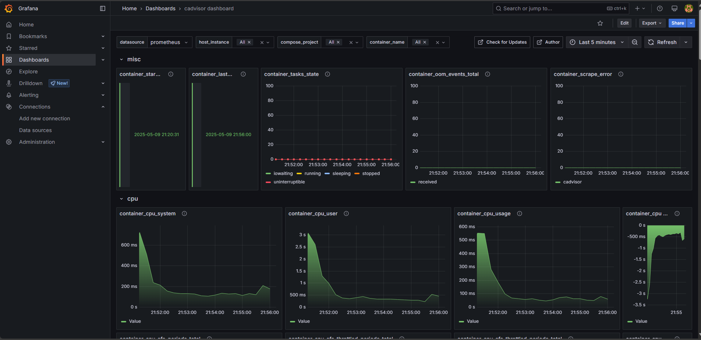
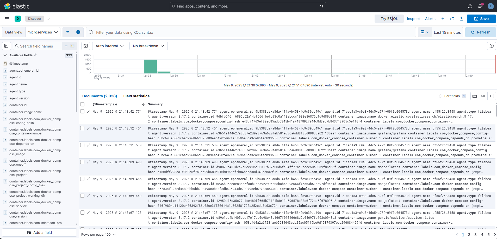
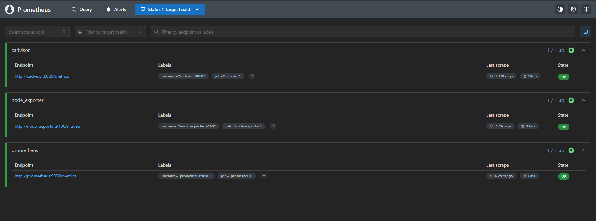

# Microservices E-Commerce

## Giới thiệu

Dự án **Microservices E-Commerce** là một hệ thống thương mại điện tử được xây dựng theo kiến trúc microservices. Mỗi service đảm nhận một chức năng cụ thể và giao tiếp với nhau thông qua các giao thức như HTTP, gRPC, hoặc message queue. Dự án này được thiết kế để dễ dàng mở rộng, bảo trì và triển khai.

### Các thành phần chính

-   **ApiGateway**: Cổng giao tiếp chính giữa client và các service, sử dụng Ocelot.
-   **ElasticStack**: Hỗ trợ logging và monitoring với ELK stack.
-   **Monitoring**: Cấu hình giám sát hệ thống với Prometheus và Grafana.
-   **Services**:
    -   **AuthService**: Quản lý xác thực và phân quyền người dùng.
    -   **CartService**: Quản lý giỏ hàng của người dùng.
    -   **NotificationService**: Gửi thông báo qua Redis và RabbitMQ.
    -   **OrderService**: Quản lý đơn hàng.
    -   **PaymentService**: Xử lý thanh toán qua VNPay và các phương thức khác.
    -   **ProductService**: Quản lý sản phẩm và kho hàng.
    -   **ReviewService**: Quản lý đánh giá sản phẩm.
-   **Shared**: Chứa các thư viện dùng chung như cấu hình JWT, middleware, và các tiện ích khác.

## Hình ảnh minh họa

### 1. Giám sát hệ thống với cAdvisor



### 2. Dashboard giám sát với Grafana




### 3. Logging với Kibana



### 4. Metrics thu thập từ Prometheus



## Công nghệ sử dụng

-   **Ngôn ngữ**: C#
-   **Framework**: .NET 9.0
-   **Cơ sở dữ liệu**:
    -   PostgreSQL (PaymentService)
    -   MongoDB (OrderService, NotificationService, ReviewService)
    -   SQL Server (AuthService, ProductService)
-   **Message Queue**: RabbitMQ
-   **Caching**: Redis
-   **Logging & Monitoring**: ELK Stack, Prometheus, Grafana
-   **API Gateway**: Ocelot

## Hướng dẫn cài đặt

### Yêu cầu hệ thống

-   Docker và Docker Compose
-   .NET SDK 9.0
-   PostgreSQL, MongoDB, Redis, RabbitMQ

### Cách chạy dự án

1. **Clone repository**:
    ```bash
    git clone https://github.com/PhucHau0310/MicroservicesECommerce.git
    cd MicroservicesECommerce/be
    ```
2. **Chạy Docker Compose**:
   `bash
docker-compose up --build
`

### Liên hệ

Tác giả: Nguyễn Phúc Hậu
Email: haunhpr024@gmail.com
